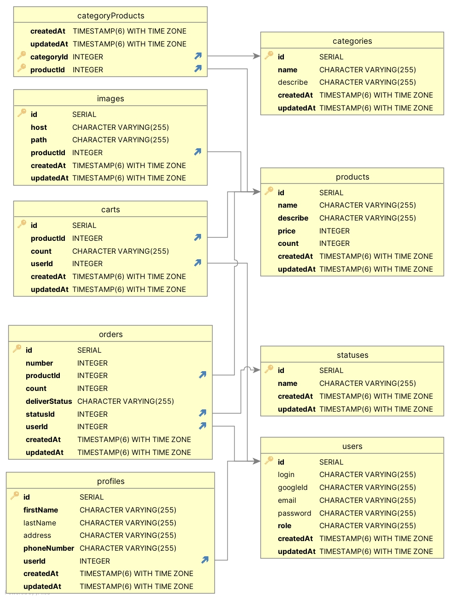

**JobHunterBot**

 
**Описание:**

JobHunterBot - это приложение, разработанное с использованием Telegram-API (подход webhook), которое упрощает взамодейстаие с сайтом для поиска работы.  

 

Основные возможности и функциональность проекта включают в себя:

&bull; Регистрация и авторизация пользователей
 
&bull; Создание профиля пользователя с личной информацией и историей заказов(редактирования )

&bull; Добавление товаров в базу данных, которые будут доступны для покупки

&bull; Реализация поиска товаров по различным параметрам

&bull; Добавление товаров в корзину и оформление заказа

&bull; Интеграция со Stripe для оплаты заказов

&bull; Просмотр истории заказов и статусов доставки

 

**Использованые технологии:** 

    Фреймворк: express
    Работа с базами данных: sequelize, postgress
    Авторизация и аутентификация: passportJS, bcript
    Документация: swagger 
    Другие: ngrok, multer, express-validator

**База данных**

Схема базы данных состоит из 9-nb таблиц: 

